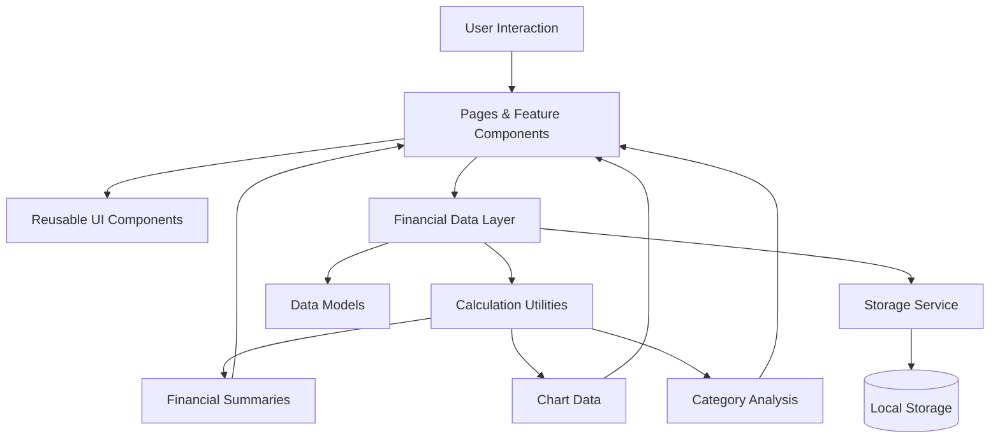

<div align="center">

# FINORA

### Visualize your money. Understand your habits. Build your future.

<br>

A modern personal finance dashboard built to transform everyday financial data into clear, meaningful insights.

<br>


<br><br>


<br><br>

[Overview](#-overview) •
[Features](#-features) •
[Analytics](#-meaningful-financial-analytics) •
[Architecture](#-architecture) •
[Getting Started](#-getting-started) •
[Roadmap](#-roadmap)

</div>

---

<br>

## ✦ Overview

**Finora** is a modern personal finance management and analytics application designed to help people understand where their money comes from, where it goes, and how their financial habits change over time.

Most financial trackers give users a long list of transactions.

Finora is being designed around a different idea:

> **Financial data should explain something.**

The application brings income, expenses, savings, investments, remittances, and financial goals into one visual workspace.

Instead of showing isolated numbers, Finora transforms financial activity into:

* meaningful summaries
* interactive visualizations
* category breakdowns
* monthly comparisons
* financial trends
* savings progress
* investment insights

The goal is not simply to record money.

The goal is to **understand it**.

<br>

---

## ◈ Product Preview

<div align="center">

### Your financial life, in one clear view.

<br>

<!-- Replace this section with the real dashboard screenshot -->


<br>

<sub>Financial overview • Spending insights • Savings progress • Investment tracking</sub>

</div>

<br>

> **Note:** Product screenshots will be added as each development phase is completed.

<br>

---

## ✦ Features

<table>
<tr>
<td width="50%" valign="top">

### ◉ Financial Overview

See your financial position without digging through transaction history.

Track:

* Total balance
* Monthly income
* Monthly expenses
* Savings
* Investments
* Remittances

</td>
<td width="50%" valign="top">

### ◫ Transaction Management

Keep financial activity organized in one place.

Manage transactions with:

* Transaction types
* Categories
* Subcategories
* Dates
* Notes
* Search
* Filters
* Sorting

</td>
</tr>

<tr>
<td width="50%" valign="top">

### ◒ Visual Analytics

Turn raw transaction data into information that is easier to understand.

Explore:

* Financial distribution
* Expense categories
* Income vs expenses
* Spending trends
* Savings growth
* Investment contributions

</td>
<td width="50%" valign="top">

### ◎ Savings Goals

Turn financial targets into visible progress.

Track goals with:

* Target amounts
* Current progress
* Target dates
* Completion percentages
* Visual progress indicators

</td>
</tr>
</table>

<br>

---

## ◉ Meaningful Financial Analytics

Finora is designed around questions, not decorative charts.

<br>

<table>
<tr>
<td align="center" width="33%">

### Where is my money going?

Understand how expenses are distributed across categories such as housing, food, education, transport, bills, healthcare, shopping, and entertainment.

</td>
<td align="center" width="33%">

### Am I spending more than I earn?

Compare income and expenses across different periods to understand your financial direction.

</td>
<td align="center" width="33%">

### Are my savings improving?

Follow savings progress over time and understand whether your financial habits are moving toward your goals.

</td>
</tr>

<tr>
<td align="center" width="33%">

### How much am I investing?

Track investment contributions and understand how much of your financial activity is directed toward long-term growth.

</td>
<td align="center" width="33%">

### What consumes most of my income?

Identify the categories responsible for the largest share of spending.

</td>
<td align="center" width="33%">

### How are my habits changing?

Use monthly comparisons and trends to understand changes in income, spending, saving, and investing.

</td>
</tr>
</table>

<br>

---

## ◒ Financial Categories

Finora organizes financial activity into clear high-level groups.

```text
FINANCIAL ACTIVITY
│
├── Income
│   ├── Salary
│   ├── Freelance
│   ├── Business
│   └── Other Income
│
├── Expenses
│   ├── Housing
│   ├── Food
│   ├── Transportation
│   ├── Education
│   ├── Healthcare
│   ├── Shopping
│   ├── Entertainment
│   └── Bills & Utilities
│
├── Savings
│   ├── Emergency Fund
│   ├── General Savings
│   └── Goal-Based Savings
│
├── Investments
│   ├── Stocks
│   ├── Funds
│   └── Other Investments
│
└── Remittances
    ├── Sent
    └── Received
```

This structure allows Finora to show both a high-level financial overview and detailed category-level analysis.

<br>

---

## ✦ Technology Stack

<div align="center">

| Layer         | Technology   | Purpose                                 |
| :------------ | :----------- | :-------------------------------------- |
| Frontend      | React        | Component-based user interface          |
| Language      | TypeScript   | Type-safe application development       |
| Build Tool    | Vite         | Fast development and optimized builds   |
| Styling       | Tailwind CSS | Consistent responsive interface styling |
| Visualization | Recharts     | Interactive financial charts            |
| Icons         | Lucide React | Clean and consistent icon system        |
| Persistence   | LocalStorage | Browser-based data persistence          |

</div>

<br>

---

## ◈ Architecture

Finora separates financial logic from presentation.

The interface should never be responsible for calculating financial results directly.



### Architecture principles

* Financial calculations remain independent from UI components.
* Reusable components reduce duplication.
* TypeScript models define consistent financial data structures.
* Storage logic is isolated from presentation logic.
* Chart data is derived from real financial calculations.
* The storage layer can later be replaced with a cloud backend without rebuilding the complete interface.

<br>

---

## ◫ Project Structure

The final structure evolves as development phases are completed.

```text
finora/
│
├── src/
│   ├── components/
│   │   ├── ui/
│   │   ├── layout/
│   │   ├── dashboard/
│   │   └── charts/
│   │
│   ├── pages/
│   │   ├── Dashboard/
│   │   ├── Transactions/
│   │   ├── Analytics/
│   │   └── SavingsGoals/
│   │
│   ├── data/
│   ├── services/
│   ├── types/
│   ├── utils/
│   ├── hooks/
│   └── App.tsx
│
├── docs/
│   └── screenshots/
│       ├── dashboard.png
│       ├── transactions.png
│       ├── analytics.png
│       └── savings-goals.png
│
├── public/
├── README.md
└── package.json
```

> The actual structure may evolve as the project grows. Architecture decisions are made incrementally rather than through premature abstraction.

<br>

---

## ◉ Getting Started

### Prerequisites

Make sure you have the following installed:

* Node.js
* npm
* Git

### Clone the repository

```bash
git clone git@github.com:abzakir/finora.git
```

### Enter the project directory

```bash
cd finora
```

### Install dependencies

```bash
npm install
```

### Start the development server

```bash
npm run dev
```

### Create a production build

```bash
npm run build
```

### Preview the production build

```bash
npm run preview
```

<br>

---

## ◫ Development Philosophy

Finora is being developed incrementally.

Each major capability is built as a separate phase, tested, reviewed, and committed independently.

```text
Foundation
    ↓
Financial Data Layer
    ↓
Dashboard Summary
    ↓
Financial Visualizations
    ↓
Transaction Management
    ↓
Local Persistence
    ↓
Search & Filtering
    ↓
Analytics
    ↓
Savings Goals
    ↓
UX Polish
    ↓
Testing
    ↓
Deployment
```

This approach keeps the codebase understandable and the Git history meaningful.

<br>

---

## ◒ Roadmap

### Foundation

* [ ] Project foundation and application shell
* [ ] Responsive navigation
* [ ] Design system
* [ ] Financial data models
* [ ] Calculation utilities

### Dashboard

* [ ] Financial summary cards
* [ ] Balance overview
* [ ] Income and expense summaries
* [ ] Savings overview
* [ ] Investment overview
* [ ] Remittance overview

### Visualizations

* [ ] Financial distribution chart
* [ ] Expense category breakdown
* [ ] Responsive chart tooltips
* [ ] Empty visualization states

### Transactions

* [ ] Responsive transaction history
* [ ] Add transactions
* [ ] Edit transactions
* [ ] Delete transactions
* [ ] Search transactions
* [ ] Category filters
* [ ] Date filters
* [ ] Transaction sorting

### Analytics

* [ ] Monthly income vs expense comparison
* [ ] Spending trends
* [ ] Savings growth visualization
* [ ] Investment contribution analysis
* [ ] Monthly financial comparisons

### Goals

* [ ] Create savings goals
* [ ] Edit savings goals
* [ ] Track progress
* [ ] Goal target dates
* [ ] Visual progress indicators

### Future Possibilities

* [ ] Authentication
* [ ] Cloud synchronization
* [ ] Supabase integration
* [ ] Recurring transactions
* [ ] Monthly budgets
* [ ] Spending limits
* [ ] CSV import and export
* [ ] PDF financial reports
* [ ] Multiple currencies
* [ ] Dark mode
* [ ] Progressive Web App support

<br>

---

## ◉ Data & Privacy

During the local-first stage of development, Finora stores financial data in the user's browser using LocalStorage.

This means:

* Financial data remains stored in the browser being used.
* Data is not automatically synchronized across devices.
* Clearing browser storage may remove saved Finora data.
* Cloud synchronization is not available during the local-only stage.

The storage architecture is intentionally separated from the interface so that a cloud-based persistence layer can be introduced in a future phase.
But it will soon be integrated

<br>

---

## ✦ Contributing

Contributions, suggestions, and improvements are welcome.

```bash
# Create a feature branch
git checkout -b feature/your-feature

# Stage your changes
git add .

# Create a meaningful commit
git commit -m "feat: add your feature"

# Push your branch
git push -u origin feature/your-feature
```

Then open a Pull Request describing the purpose of the change.

Please keep contributions focused and avoid combining unrelated changes into a single pull request.

<br>

---

## ◈ Development Status

Finora is currently under active development.

The application is being built phase by phase, with each major feature implemented, tested, and reviewed independently.

Follow the repository to watch the project evolve from its foundation into a complete financial analytics experience.

<br>

---

<div align="center">

# FINORA

### Visualize your money. Understand your habits. Build your future.

<br>

Built with React, TypeScript, and a belief that financial data should be understandable.

<br>

If Finora interests you, consider giving the project a star.

<br>

**Track better. Understand more. Grow intentionally.**

</div>
